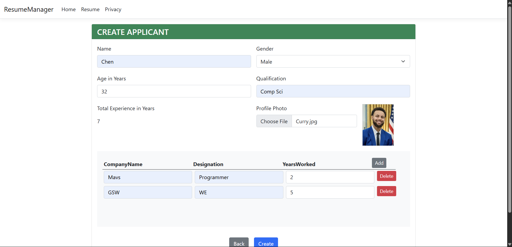

# Resume Manager (ASP.NET 8 MVC with Entity Framework Core)
This is a dynamic Master-Detail CRUD application built using ASP.NET 8 MVC and Entity Framework Core. It demonstrates how to add, remove, and manage master and detail records seamlessly in a single form using modern techniques in EF Core.

Demo: https://www.linkedin.com/feed/update/urn:li:activity:7329360891462799360/

## Features
✅ Add or remove rows dynamically on the master-detail page  
✅ Create and save master-detail records together efficiently  
✅ Client-side jQuery validation for the detail grid  
✅ View a list of all master records  
✅ Full CRUD (Create, Read, Update, Delete) support

## Technologies Used
- ASP.NET 8 MVC
- Entity Framework Core
- SQL Server
- jQuery & JavaScript
- Bootstrap 5
- Visual Studio 2022

## Page View
#### Home Page

#### List of Apllicants Page

#### Edit, Update and Delete Applicants Page

## Reference
https://youtu.be/MoLaynKMOoc?si=24uShwpMYKo96C1H
